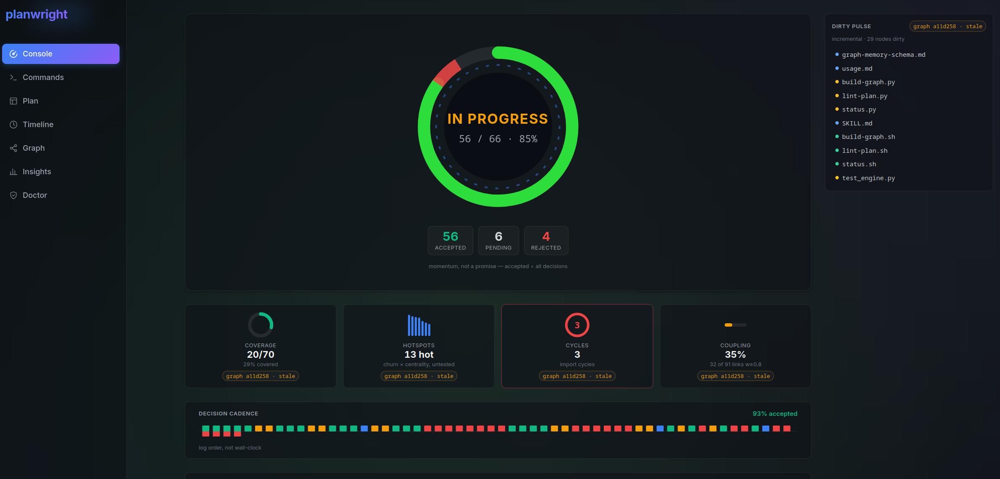
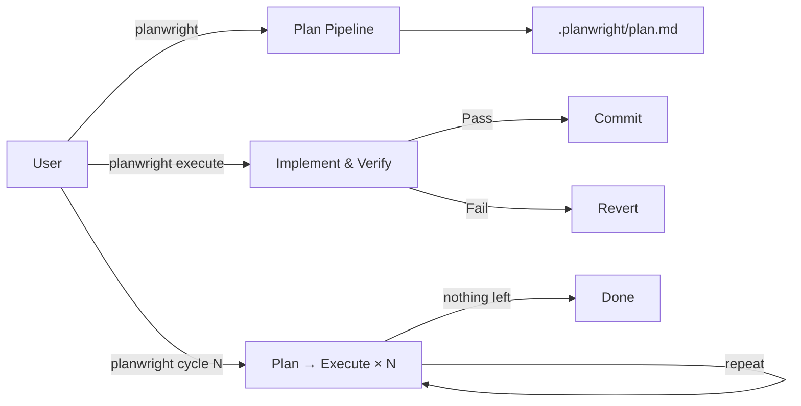

# planwright

**A free, local control loop for AI coding agents: grounded planning, verification, execution, and repeatable codebase improvement.**

> Use `/codvisor` to repair and harden a repo, `/codinventor` to add grounded new capability,
> `/codcycle` to alternate both, `/codshard` to mature a large repo shard by shard — or
> `/codmaster`, the front door that senses what the repo needs and drives it, command by command,
> to a recorded final point. Planwright works through the AI coding agent you already use:
> Claude Code, Codex, Cursor, Antigravity, Gemini, or any AGENTS.md-aware agent.



> The read-only [dashboard](docs/usage.md#dashboard-live-read-only-web-view) (`planwright dashboard`) — a live mirror of the `.planwright/` planning state: convergence reactor, plan tallies, code vitals, decision cadence, and a dirty-pulse of changed files. It watches; it never drives.

Planwright is a planning-first control loop for codebase work. It reads your project, finds work worth
doing, and writes it down as a checklist of concrete, verifiable steps in `.planwright/plan.md`. It
can then work through that checklist for you — implementing each item, testing it, and committing
the ones that pass.

Every item it proposes must point back to real code (a `file:line` reference) and ship with a
command that proves it works. That's what **"grounded"** means: no vague advice, no invented
features floating free of your actual repository.

Automated AI coding should not require a proprietary cloud engineer. Planwright brings that loop to the coding agent you already use.

## Why Planwright exists

Modern AI coding tools are increasingly built with AI coding tools themselves. That loop should not be limited to large AI labs or proprietary hosted platforms.

Planwright brings the same pattern to ordinary repositories: your agent inspects the codebase, writes grounded and verifiable work items, implements them, runs the checks, commits what passes, and repeats.

The difference is control. Planwright is local, free, agent-neutral, and file-based. You can inspect the plan, reject weak items, keep normal approval prompts, and move the same workflow between Claude Code, Codex, Cursor, Gemini, Antigravity, or any AGENTS.md-aware agent.

## Install in 60 seconds

On Claude Code:

```bash
/plugin marketplace add eserlxl/planwright
/plugin install planwright@eserlxl
```

Plugin commands are namespaced: `/planwright:codvisor`, `/planwright:codmaster`, and so on
(`/planwright` itself works as typed — the prefix applies to the five shortcuts). This README's
examples use the short spellings (`/codvisor`, `/codmaster`) — install them as
[local aliases](#local-shortcut-aliases-drop-the-planwright-prefix), or mentally prefix
`planwright:`. For Codex, Cursor, Antigravity/Gemini, and AGENTS.md-aware agents, see
[Install](#install).

## Start here

The four **direct dials** each drive one motion — repair, invention, alternation, scale. Run any
of them with no arguments and Planwright does the rest: it prints the estimated AI/session cost
first, then works autonomously through plan→build→verify rounds until it runs out of worthwhile
work.

| Command        | What it does                       | Best for           |
|----------------|------------------------------------|--------------------|
| `/codvisor`    | Fixes real work, stops when clean. | Analyze and repair |
| `/codinventor` | Discovers and adds grounded new capabilities. | Feature discovery  |
| `/codcycle`    | Alternates repair and invention rounds.     | Autonomous improvement  |
| `/codshard`    | Matures the repo shard by shard, then closes whole-repo. | Large codebases |

**`/codmaster`** — the front door — folds all of the above into one autonomous drive. A tested,
read-only decision engine senses the repo's planning state, and codmaster dispatches whatever it
calls for — pending items to finish, a `/codvisor` repair sweep, a `/codshard` pass on a large
repo, one `/codinventor` growth burst once the tree is clean, or (rarely) a cold-start reset —
re-sensing after every step until
the repo reaches its recorded *final point* (`.planwright/final.md`: the written-down marker that
nothing worth doing is left). It repairs before it grows, explains every choice with the numbers
behind it, and stops itself on blockers, failed verification, stalls, or the 12-step safety cap.

Three words tune it: `advise` (report what it would run — run nothing), `safe` (the same drive,
never inventing), and `loop` (reset and start a fresh lap at every convergence, until interrupted
or hard-stopped). The full tour — what each mode prints, the growth-once-per-run rule, lap
mechanics — lives in [Concepts → codmaster](docs/concepts.md#codmaster--the-front-door).

All five are autonomous in workflow, not unchecked in permissions: planning never touches your
source, and when Planwright does start editing — building items, committing — your host agent's
normal edit, terminal, and commit approval prompts still apply.

> Under the hood:
>
> - `/codvisor` = `cycle 10 depth 10 explore`; `/codinventor` = `cycle 10 depth 10 invent`. Pass
>   numbers to tune either (`/codvisor 5 8` = 5 rounds at depth 8) — see [Usage](docs/usage.md).
> - `/codcycle` *orchestrates* many such runs — an explore then a framing-rotated invent per outer
>   cycle, with one closing explore — so reach for it when you want codvisor and codinventor on a loop.
> - `/codshard` is the other orchestrator: one scoped cycle per top-level directory (so each shard
>   gets the full depth budget), then one closing whole-repo round (add `explore` to escalate just
>   that closing round).
> - `/codmaster` sits above all of these and owns no logic of its own: a tested decision table
>   (`status.py --recommend`, the same table the dashboard's Commands view renders) maps repo state
>   to the next command, and codmaster dispatches it at depth 10 — where `/codcycle` runs a fixed
>   rhythm, codmaster re-decides every step from fresh state.
>
> The full vocabulary lives in [Concepts](docs/concepts.md).

## How it works: three paths

Planwright separates *deciding what to do* from *doing it*. There are three paths:

- **Plan** *(read-only)* — audits the codebase and writes verified plan items to
  `.planwright/plan.md`. Each item cites real `file:line` evidence and carries a runnable
  verification command. This path never edits your source.
- **Execute** — works through the pending plan items: implements each, runs its verification, commits
  the ones that pass, and records the rest. This is the only path that edits source.
- **Cycle** — runs N plan→execute rounds unattended, climbing a maturity ladder
  (repair → coverage → opportunity → vision) until the work runs dry. The `explore` and `invent`
  flags (which power `/codvisor` and `/codinventor`) push it further. You can also scope any run to a
  single component with `path`/`lib`.

  → See [Concepts](docs/concepts.md) for the full story on `cycle`, `explore`, `invent`, `seed`, and
  scoping, in plain language.



Your AI coding agent runs every stage through the skill. Planwright ships no background daemon,
hosted service, or separate model integration — the mechanical stages run through bundled stdlib-only Python
helpers — and it makes no API/model calls beyond the active session.

On larger codebases it keeps audits efficient with a **graph memory** under the gitignored
`.planwright/` — a map of how files import and change together, so it focuses on the code that
matters most and re-audits only what changed between runs. See
[Graph memory](docs/graph-memory-schema.md) for the schema and details.

**Watch it work (optional).** The `planwright dashboard` command serves a **read-only** local web view of that
`.planwright/` state — convergence, plan progress, the coupling graph, cadence, and environment
preflight — so you can watch an unattended `cycle` evolve in a browser instead of re-running
summaries. It is a mirror, never a remote control: it launches no agent and edits nothing. `dashboard` is an
ordinary subcommand on every host — ask your agent to run `planwright dashboard` (Cursor:
`@planwright dashboard`); on Claude Code, the **`/planwright:dashboard`** command opens it for
you. See [Usage → Dashboard](docs/usage.md#dashboard-live-read-only-web-view).

> **Note on safety:** Planning never edits your application source — only `execute` and `cycle` do,
> and your normal edit/commit approval prompts still apply. Protected paths (`.git/`,
> `.planwright/` internals, `LICENSE`, secrets) are never touched. (The one rare exception —
> `invent` editing `MISSION.md` — is explained in [Concepts](docs/concepts.md#missionmd-edits-under-invent).)

## How Planwright differs from `/plan` and `/ultraplan`

Claude Code already ships built-in planning: **`/plan`** enters *plan mode* — Claude proposes a plan, blocks edits until you approve, then executes in the same session.

**`/ultraplan`** is currently a research-preview Claude Code feature, so its behavior may change. It refines a plan with a heavier, cloud-backed remote session.

Both are general-purpose, session-scoped plans. Planwright is a different shape of tool: it produces a **grounded, verifiable, persistent plan artifact** for codebase work.

| | `/plan` (built-in mode) | `/ultraplan` (built-in, cloud) | **Planwright** |
|---|---|---|---|
| Nature | Session *mode* | Cloud plan *refinement* | Pipeline that emits a plan *file* |
| Plan lives | Ephemeral (approval modal) | Remote session | Persistent `.planwright/plan.md` (+ completed/rejected/graph) |
| Grounding | Model judgment | Model judgment (stronger) | Every item cites real `file:line` evidence; mechanically gated by `lint-plan.py` |
| Output | Free-form prose | Free-form prose | Exact 8-field checkbox items, each with a runnable `Verification:` |
| Execution | Exit mode → implement now | Same | Separate `execute` path: implements, **runs each item's verification, commits per item**, records pass/fail |
| Iteration | One-shot | One-shot refine | `cycle N` climbs a maturity ladder to a recorded **final point** |
| Runs | Local | Cloud (web auth) | Runs inside the active AI coding agent — no required daemon, server, or API/model integration (bundled Python helpers) |

**Rules of thumb:** reach for **`/plan`** to think through any task you'll execute right away; **`/ultraplan`** when you want cloud-grade refinement on a hard problem; **Planwright** when you want a grounded, verifiable plan of *codebase* work — especially unattended multi-round progress (`cycle`) with per-item verification and commits. They compose, too: design with `/plan`, then let Planwright drive the verified execution.

## Example Plan Item

A plan item is a checkbox title plus seven required continuation fields (an optional eighth,
`New Surfaces:`, lists files the item is allowed to create):

```md
- [ ] Guard README plan examples against schema drift
      Mode: docs
      Rationale: The README teaches the plan item format users copy into `.planwright/plan.md`.
      Evidence: README.md:172 names the required shape for plan items.
      Surfaces: README.md, tests/run.sh
      Development: Keep the example aligned with the SKILL.md OUTPUT FORMAT and lint-plan.py checks.
      Acceptance: The example shows the checkbox title and every required continuation field.
      Verification: bash tests/run.sh
```

## Documentation

For deep dives into how Planwright operates, refer to the documentation:

- [Concepts](docs/concepts.md): How Planwright thinks — `cycle`, `explore`, `invent`, `seed`, and scoping, in plain language. **Start here if the flags above are new to you.**
- [Mission](MISSION.md): Purpose, scope, and non-goals — the charter the maturity ladder aligns to.
- [Usage](docs/usage.md): Detailed CLI reference, options, execute modes, the read-only `status`/`dashboard` views, and a troubleshooting guide (reading `final.md`, why a run wrote 0 items, scope no-match, and `build-graph.py --debug` for routing surprises).
- [Architecture](docs/architecture.md): Explanation of the 11-stage planning pipeline and execute loop.
- [Development](docs/development.md): How to develop this plugin and use the provided helper scripts.
- [Graph memory](docs/graph-memory-schema.md): The `.planwright/graph.json` / `digest.md` schema and how Stage 1.5 routes audit attention.
- [Scope design](docs/scope-design.md): The `path`/`lib` component-scoping model — Focus vs. Context and how a scoped run stays grounded.

## Install

Planwright runs inside an AI coding assistant — no background daemon or hosted service; bundled stdlib-only Python helper scripts do the mechanical work. Install the skill for the host in use.

### Command adapters

The workflow has one argument grammar: `planwright <args>`. Each host only changes the trigger token:

| Host | Use this trigger | Shortcut spelling |
|------|------------------|-------------------|
| Claude Code | `/planwright <args>` | `/codvisor`, `/codinventor`, `/codcycle`, `/codshard`, `/codmaster` |
| Codex | `planwright <args>` after installing/loading the skill | `codvisor`, `codinventor`, `codcycle`, `codshard`, `codmaster` |
| Cursor | `@planwright <args>` or `planwright <args>` | `@codvisor`/`codvisor` — likewise `codinventor`, `codcycle`, `codshard`, `codmaster` |
| Antigravity / Gemini | `planwright <args>` from the `GEMINI.md` project instruction | `codvisor`, `codinventor`, `codcycle`, `codshard`, `codmaster` |

### Why any agent can host it

Planwright is not re-implemented per agent. The entire workflow lives in one agent-neutral file, `skills/planwright/SKILL.md`, backed by stdlib-only Python helpers in `scripts/`. Everything host-specific is a **thin adapter** — a plugin manifest or a pointer file whose only job is "read `SKILL.md`, resolve helper scripts from `../../scripts/`." The named hosts above just differ in how that adapter is delivered (a `.claude-plugin/`/`.codex-plugin/` manifest, a Cursor skill symlink, or a `GEMINI.md` instruction).

Because of this, any agent that reliably reads a project `AGENTS.md` file can host Planwright without a dedicated adapter. Drop the block from [`AGENTS.example.md`](AGENTS.example.md) into the target repo's `AGENTS.md` and the agent will dispatch `planwright` and all five `cod*` shortcuts through the same shared skill. This covers AGENTS.md-aware agents such as Windsurf, Cline, Roo Code, Amp, and Zed in addition to the first-class hosts above. The only requirement for full fidelity is that the host can run the bundled Python helpers; agents that cannot execute scripts get the planning prose but not the graph-backed grounding.

### Claude Code

The recommended path is the plugin install — the same two commands as
[Install in 60 seconds](#install-in-60-seconds); manual skill copy is only for users not using
the plugin system. To work from a local clone instead, add the clone as a marketplace:

```bash
/plugin marketplace add <PLANWRIGHT_FOLDER>
/plugin install planwright@eserlxl
```

To use it without the plugin system, copy `skills/planwright/` into `~/.claude/skills/`.

Then invoke with `/planwright` — and the shortcuts as `/planwright:codvisor`, `/planwright:codmaster`, and so on, or bare after [installing the aliases](#local-shortcut-aliases-drop-the-planwright-prefix). Upgrade with `/planwright upgrade`.

#### Local shortcut aliases (drop the `planwright:` prefix)

Claude Code namespaces every plugin command by the plugin name, so Planwright's commands are invoked as `/planwright:codvisor`, `/planwright:codcycle`, and so on. That prefix is mandatory for plugin-provided commands — it prevents collisions between plugins, and a plugin has no way to register an unprefixed top-level command. Only the **user** (`~/.claude/commands/`) and **project** (`.claude/commands/`) scopes can hold unprefixed commands, and a plugin can't write into either.

If you'd rather type the bare `/codvisor`, `/codinventor`, `/codcycle`, `/codshard`, and `/codmaster`, install thin personal aliases that just forward to the real plugin commands:

```bash
scripts/install-aliases.sh              # → ~/.claude/commands/ (all your projects)
scripts/install-aliases.sh --project    # → ./.claude/commands/ (this repo only)
scripts/install-aliases.sh --uninstall  # remove them again
```

Each alias only forwards its arguments to `/planwright:<name>`, so they never duplicate or drift from the plugin's logic. Restart Claude Code (or `/clear`) after installing. These aliases are per-machine — they aren't (and can't be) shipped inside the plugin itself. Installed from the GitHub marketplace with no local clone? Clone the repo once just to run the installer — the generated aliases are self-contained, so the clone can be removed afterwards.

### Cursor

Planwright runs as a Cursor Agent Skill — the same agent-neutral `SKILL.md` workflow, without a plugin marketplace. See [`AGENTS.example.md`](AGENTS.example.md) for the full setup guide.

**Recommended (once per machine):** symlink the skill so bundled scripts resolve correctly:

```bash
mkdir -p ~/.cursor/skills
ln -s <PLANWRIGHT_FOLDER>/skills/planwright ~/.cursor/skills/planwright
```

For the `cod*` shortcuts (`codvisor`, `codinventor`, `codcycle`, `codshard`, `codmaster`), use the `AGENTS.md` block in [`AGENTS.example.md`](AGENTS.example.md) or add thin dispatcher skills (see that file for details).

**Lightweight alternative:** copy the `AGENTS.md` block from [`AGENTS.example.md`](AGENTS.example.md) into the root of each target project.

Then invoke in chat with `@planwright`, natural-language `planwright …` arguments, or the `cod*` shortcuts. Cursor's normal edit and terminal approval prompts apply on the execute and cycle paths. Upgrade by `git pull` in the Planwright clone (there is no `/plugin upgrade` on Cursor).

### Codex

Planwright works best on Codex as a local plugin, because the plugin keeps this repository's
`skills/planwright` and `scripts/` layout together. Codex also supports direct user skills under
`~/.agents/skills`.

**Recommended: local plugin marketplace**

Keep this repository as the plugin root, or symlink/copy it to the personal plugin area:

```bash
mkdir -p ~/plugins ~/.agents/plugins
ln -s <PLANWRIGHT_FOLDER> ~/plugins/planwright
```

Create or update `~/.agents/plugins/marketplace.json`:

```json
{
  "name": "personal",
  "interface": {
    "displayName": "Personal"
  },
  "plugins": [
    {
      "name": "planwright",
      "source": {
        "source": "local",
        "path": "./plugins/planwright"
      },
      "policy": {
        "installation": "AVAILABLE",
        "authentication": "ON_INSTALL"
      },
      "category": "Productivity"
    }
  ]
}
```

Then install from the personal marketplace and start a new Codex thread:

```bash
codex plugin add planwright@personal
```

The `./plugins/planwright` path is resolved relative to the personal marketplace root (`~`), not
relative to `~/.agents/plugins/`.

**Direct skill install (simple):**

```bash
mkdir -p ~/.agents/skills
ln -s <PLANWRIGHT_FOLDER>/skills/planwright ~/.agents/skills/planwright
```

Codex follows symlinked skill folders, which is important here because Planwright resolves helper
scripts from `../../scripts/` relative to `skills/planwright`. If you copy instead of symlink, keep
that layout intact or use the plugin path above.

Invoke in chat with `planwright`, for example `planwright depth 8`, `planwright execute`, or
`planwright cycle 3`. You can also explicitly mention the skill as `$planwright`. Use the `cod*`
shortcuts (`codvisor`, `codinventor`, `codcycle`, `codshard`, `codmaster`) as natural-language
commands, or add a small dispatcher skill that reads the matching `commands/<name>.md` and then
loads `skills/planwright/SKILL.md` with the resolved argument string.

### Antigravity / Gemini

Planwright can be run directly via Antigravity or Gemini project instructions. Copy the contents of [`GEMINI.example.md`](GEMINI.example.md) into a `GEMINI.md` file in the root of each target project, and update the absolute path to point to the Planwright clone.

Then ask the assistant to run `planwright` or use the `cod*` shortcut commands (`codvisor`, `codinventor`, `codcycle`, `codshard`, `codmaster`).

## Optional: context-mode

On large repos or at higher planning depths, the plan path's mechanical stages (especially Stage 1 scan and Stage 1.5 graph build) can emit bulky `rg`/`git` output. The skill can route that through [context-mode](https://github.com/mksglu/context-mode) (`ctx_execute` / `ctx_batch_execute`) so only summarized results enter the session. The integration is optional on every host; without it, Planwright falls back to capped Shell output or the by-hand fallbacks in the skill.

## Quick Start

Examples below use Claude Code slash-command spelling. On Codex, Cursor, Antigravity, or Gemini, use
the equivalent trigger from the command adapter table and keep the arguments the same.

```bash
# First run: preflight git/rg/python3, the .planwright/ gitignore, and your commit
# identity up front (--fix adds the gitignore rule)
/planwright doctor

# Generate a plan (read-only), then execute the pending items
/planwright
/planwright execute

# Or run plan→execute rounds in a loop, tuning depth 1..10 (default 6)
/planwright cycle 3 depth 8

# The dials and the front door, in their flagship forms
/codvisor                  # repair: cycle 10 depth 10 explore
/codinventor               # invent: cycle 10 depth 10 invent
/codcycle                  # 10 outer cycles of explore → framing-rotated invent, one closing explore
/codshard                  # cycle 3 depth 10 per shard (staleness order), then a closing whole-repo round
/codmaster                 # sense → dispatch → re-sense at depth 10 until the final point (advise | safe | loop)

# Aim any run at one component (composes with execute/cycle)
/planwright path src/auth/      # plan only the auth subtree (Focus); still reads its 1-hop deps (Context)
/planwright lib parser cycle 5  # mature just the 'parser' component over 5 cycles

# Maintenance
/planwright status     # read-only: summarize plan / final-point / graph state (--json)
/planwright upgrade    # update planwright itself (alias: update)
```

The full reference — request-seeded plans (`/planwright "add OAuth login"`), the
`explore`/`invent`/`seed` escalation flags, numeric dial forms (`/codvisor 5 8`),
`codshard shards`/`parallel`, infinite cycles, `reset`, `version` — lives in
[Usage](docs/usage.md).

## Development & Releasing

```bash
# Run the test suite (a bare run = everything)
bash tests/run.sh
bash tests/run.sh lint-plan lifecycle   # just those topic cases, for a focused loop

# Bump the version in manifests + CHANGELOG (does NOT tag or release)
scripts/bump-version.sh patch -m "what changed"

# Preview a bump without modifying files
scripts/bump-version.sh --dry-run patch

# Show usage for the helper scripts
scripts/bump-version.sh --help
scripts/make-plugin.sh --help

# Create a tagged release — only at milestones (every 25-50 commits or a
# meaningful feature: new subcommand, major behavior change, etc.)
git tag vX.Y.Z <release-commit-sha>
git push origin vX.Y.Z
```

**Release policy:** `bump-version.sh` is for keeping version numbers current during development. Git tags and GitHub releases are reserved for milestones — not every small fix. Tagging too frequently fragments the changelog and dilutes the signal of what a "release" means.

## License

GPL-3.0-or-later. See [LICENSE](LICENSE).
