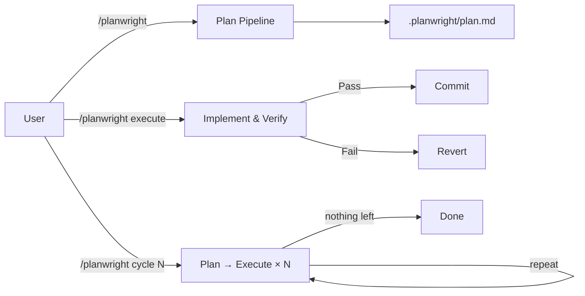

# planwright

**Grounded codebase planning for Claude Code.**

> Invoke it with `/planwright` — or the `/codvisor` shortcut for the flagship advisor run (`cycle 10 depth 10 explore`), or `/codinventor` to also propose net-new, seam-bound features (`cycle 10 depth 10 invent`).

Planwright is a planning-first Claude Code skill for codebase work. It audits a project, writes grounded implementation items to `.planwright/plan.md`, and can optionally execute verified items one by one.

"Grounded" means every planned change must point back to concrete repository evidence, such as `file:line` references.

It operates using three distinct, partitioned paths:

- **Plan** — scans and audits the codebase, then runs a multi-stage pipeline to emit concrete, verified plan items into `.planwright/plan.md`. A valid plan item must cite real file/line evidence and include a runnable verification command. Read-only: the plan path writes only the plan file, never your source.
- **Execute** — implements the pending plan items, verifies each, commits the ones that pass, and records the rest. This is the only path that edits source.
- **Cycle** — runs N plan→execute rounds unattended, climbing a maturity ladder (repair → coverage → opportunity → vision) so a clean tree keeps producing valuable work, and stopping at a recorded *final point* when every rung is dry (pass `-N` to run until then). The opt-in **`explore`** flag turns that final point into one bounded sweep of the *cold frontier* — code the default routing under-examines — before stopping, without ever lowering the grounding bar. (See [Usage](docs/usage.md) for the full `cycle`/`explore` reference.)



Claude Code runs every stage through the skill, so planwright needs no external binary and makes no separate API/model calls beyond the active Claude Code session.

To keep large-codebase audits efficient, the plan path builds a **graph memory** (`.planwright/graph.json`) — import and change-coupling edges, PageRank, and articulation points — that routes audit attention toward code where changes can affect many other files and lets repeat runs re-audit only the changed subgraph. A companion `.planwright/digest.md` carries routing-only summaries that are never cited as Evidence. Both live under the gitignored `.planwright/`. See [Graph memory](docs/graph-memory-schema.md) for the schema and stages.

> **Note**: Planning never edits your application source. Only `/planwright execute` and `/planwright cycle` do — and even then, Claude Code's normal permission prompts for edits and commits still apply.

## How planwright differs from `/plan` and `/ultraplan`

Claude Code already ships built-in planning: **`/plan`** enters *plan mode* — Claude proposes a plan, blocks edits until you approve, then executes in the same session.

**`/ultraplan`** is currently a research-preview Claude Code feature, so its behavior may change. It refines a plan with a heavier, cloud-backed remote session.

Both are general-purpose, session-scoped plans. planwright is a different shape of tool: it produces a **grounded, verifiable, persistent plan artifact** for codebase work.

| | `/plan` (built-in mode) | `/ultraplan` (built-in, cloud) | **planwright** |
|---|---|---|---|
| Nature | Session *mode* | Cloud plan *refinement* | Pipeline that emits a plan *file* |
| Plan lives | Ephemeral (approval modal) | Remote session | Persistent `.planwright/plan.md` (+ completed/rejected/graph) |
| Grounding | Model judgment | Model judgment (stronger) | Every item cites real `file:line` evidence; mechanically gated by `lint-plan.py` |
| Output | Free-form prose | Free-form prose | Exact 8-field checkbox items, each with a runnable `Verification:` |
| Execution | Exit mode → implement now | Same | Separate `execute` path: implements, **runs each item's verification, commits per item**, records pass/fail |
| Iteration | One-shot | One-shot refine | `cycle N` climbs a maturity ladder to a recorded **final point** |
| Runs | Local | Cloud (web auth) | Runs inside Claude Code — no extra binary, daemon, server, or separate API/model integration |

**Rules of thumb:** reach for **`/plan`** to think through any task you'll execute right away; **`/ultraplan`** when you want cloud-grade refinement on a hard problem; **planwright** when you want a grounded, verifiable plan of *codebase* work — especially unattended multi-round progress (`cycle`) with per-item verification and commits. They compose, too: design with `/plan`, then let planwright drive the verified execution.

## Example Plan Item

A plan item has this 8-field shape:

```md
- [ ] ID: PW-001
  Title: Add missing validation for config loading
  Evidence: `src/config.ts:42`
  Risk: Low
  Change: Validate required keys before use.
  Verification: `npm test -- config`
  Files: `src/config.ts`, `tests/config.test.ts`
  Status: pending
```

## Documentation

For deep dives into how `planwright` operates, refer to the documentation:

- [Mission](MISSION.md): Purpose, scope, and non-goals — the charter the maturity ladder aligns to.
- [Usage](docs/usage.md): Detailed CLI reference, options, and execute modes.
- [Architecture](docs/architecture.md): Explanation of the 11-stage planning pipeline and execute loop.
- [Development](docs/development.md): How to develop this plugin and use the provided helper scripts.
- [Graph memory](docs/graph-memory-schema.md): The `.planwright/graph.json` / `digest.md` schema and how Stage 1.5 routes audit attention.

## Install

Requires Claude Code. The plugin install path is recommended; manual skill copy is only for users not using the plugin system.

```bash
/plugin marketplace add eserlxl/planwright
/plugin install planwright@eserlxl
```

Or add a local clone as a marketplace:

```bash
/plugin marketplace add <PLANWRIGHT_FOLDER>
/plugin install planwright@eserlxl
```

To use it without the plugin system, copy `skills/planwright/` into `~/.claude/skills/`.

## Quick Start

```bash
# Generate a plan for your project
/planwright

# Break a specific request into plan items
/planwright "add OAuth login"

# Tune analysis depth 1..10 (intensity + audit thoroughness; default 6)
/planwright depth 9          # exhaustive audit
/planwright depth 2          # quick cosmetic pass

# Execute the pending plan items automatically
/planwright execute

# Run plan→execute in a loop
/planwright cycle 3            # exactly 3 rounds
/planwright cycle 3 depth 8    # 3 rounds, deep planning each round
/planwright cycle -1           # repeat until every maturity rung produces no actionable work
/planwright cycle 10 depth 10 explore  # at the final point, escalate: cold-frontier sweep → expand (complete latent capability)
/planwright cycle 10 depth 10 invent   # …and, with permission, a net-new seam-bound invent burst after expand is dry

# /codvisor — a short helper command that forwards to planwright
/codvisor                  # flagship advisor run: cycle 10 depth 10 explore (prints the cost first)
/codvisor 15               # cycle 15 depth 10 explore (one number = cycles; depth defaults to 10)
/codvisor 5 8              # cycle 5 depth 8 explore (cycles, depth)
/codvisor help             # passthrough: same as /planwright help (any planwright args work)

# /codinventor — the invent twin of /codvisor (permits net-new, seam-bound features)
/codinventor               # flagship inventor run: cycle 10 depth 10 invent (prints the cost first)
/codinventor 15            # cycle 15 depth 10 invent (one number = cycles; depth defaults to 10)
/codinventor 5 8           # cycle 5 depth 8 invent (cycles, depth)

# Maintenance
/planwright version    # show current and latest available version
/planwright upgrade    # update planwright itself to the latest version (alias: update)
```

## Development & Releasing

```bash
# Run the test suite
bash tests/run.sh

# Bump the version in manifests + CHANGELOG (does NOT tag or release)
scripts/bump-version.sh patch -m "what changed"

# Preview a bump without modifying files
scripts/bump-version.sh --dry-run patch

# Show usage for the helper scripts
scripts/bump-version.sh --help
scripts/make-plugin.sh --help

# Create a tagged release — only at milestones (every 25-50 commits or a
# meaningful feature: new subcommand, major behavior change, etc.)
git tag vX.Y.Z <release-commit-sha>
git push origin vX.Y.Z
```

**Release policy:** `bump-version.sh` is for keeping version numbers current during development. Git tags and GitHub releases are reserved for milestones — not every small fix. Tagging too frequently fragments the changelog and dilutes the signal of what a "release" means.

## License

GPL-3.0-or-later. See [LICENSE](LICENSE).
