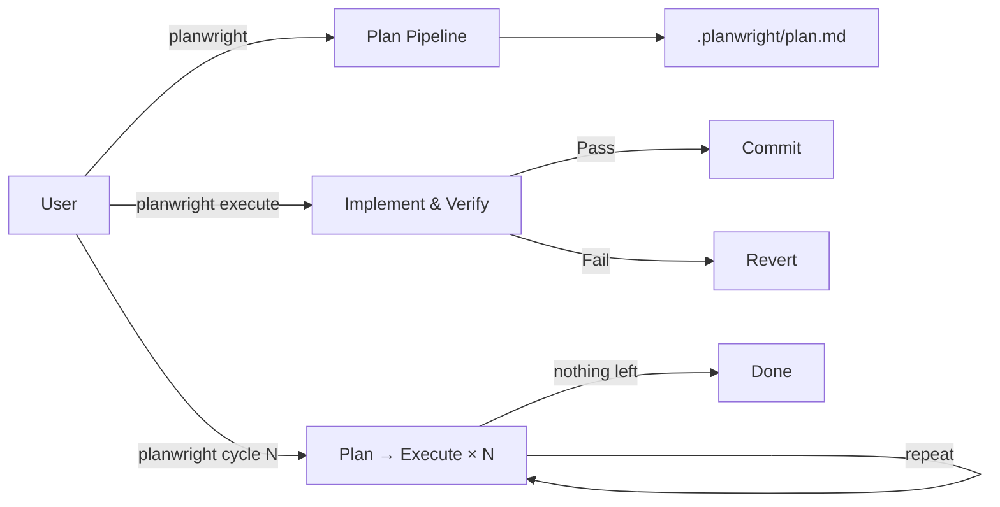

# planwright

**Grounded codebase planning for AI coding agents (Claude Code, Codex, Cursor, Antigravity, and Gemini).**

> Invoke it with your host's `planwright` trigger — for example `/planwright` on Claude Code,
> `@planwright` on Cursor, or `planwright` in Codex/Antigravity/Gemini project instructions. The
> `codvisor` shortcut resolves to `cycle 10 depth 10 explore`; `codinventor` resolves to
> `cycle 10 depth 10 invent`; and `codcycle` loops the two together — explore then an adaptive
> invent each outer cycle, with one closing explore.

Planwright is a planning-first skill for codebase work. It reads your project, finds work worth
doing, and writes it down as a checklist of concrete, verifiable steps in `.planwright/plan.md`. It
can then work through that checklist for you — implementing each item, testing it, and committing
the ones that pass.

Every item it proposes must point back to real code (a `file:line` reference) and ship with a
command that proves it works. That's what **"grounded"** means: no vague advice, no invented
features floating free of your actual repository.

## Start here: the three commands

Most people only need these three. Run them with no arguments and planwright does the rest — it prints
the cost first, then works autonomously through plan→build→verify rounds until it runs out of
worthwhile work.

| Command | What it does | Reach for it when… |
|---|---|---|
| `/codvisor` | Finds and fixes real work in your code, then stops when it's clean. | You want it polished and hardened, hands-off. |
| `/codinventor` | Fixes real work **and** proposes net-new features, anchored to real code. | You want it to also *grow*, not just tidy. |
| `/codcycle` | Loops the two — harden then grow each cycle (invent effort *adapts*), with a final harden. | You want a long run that keeps polishing **and** growing. |

All three are safe by default: planning never touches your source, and when planwright does start editing
(building items, committing), your normal edit/commit approval prompts still apply.

> Under the hood, `/codvisor` is shorthand for `cycle 10 depth 10 explore` and `/codinventor` for
> `cycle 10 depth 10 invent`. You can pass numbers to tune them (`/codvisor 5 8` = 5 rounds at
> depth 8) — see [Quick Start](#quick-start). `/codcycle` *orchestrates* many such runs — an explore
> then an adaptive invent per outer cycle, with one closing explore — so reach for it when you want
> codvisor and codinventor on a loop. The full vocabulary lives in [Concepts](docs/concepts.md).

## How it works: three paths

Planwright separates *deciding what to do* from *doing it*. There are three paths:

- **Plan** *(read-only)* — audits the codebase and writes verified plan items to
  `.planwright/plan.md`. Each item cites real `file:line` evidence and carries a runnable
  verification command. This path never edits your source.
- **Execute** — works through the pending plan items: implements each, runs its verification, commits
  the ones that pass, and records the rest. This is the only path that edits source.
- **Cycle** — runs N plan→execute rounds unattended, climbing a maturity ladder
  (repair → coverage → opportunity → vision) until the work runs dry. The `explore` and `invent`
  flags (which power `/codvisor` and `/codinventor`) push it further. You can also scope any run to a
  single component with `path`/`lib`.

  → See [Concepts](docs/concepts.md) for the full story on `cycle`, `explore`, `invent`, `seed`, and
  scoping, in plain language.



Your AI coding agent runs every stage through the skill, so planwright needs no external binary and
makes no separate API/model calls beyond the active session.

On larger codebases it keeps audits efficient with a **graph memory** under the gitignored
`.planwright/` — a map of how files import and change together, so it focuses on the code that
matters most and re-audits only what changed between runs. See
[Graph memory](docs/graph-memory-schema.md) for the schema and details.

> **Note on safety:** Planning never edits your application source — only `execute` and `cycle` do,
> and your normal edit/commit approval prompts still apply. Protected paths (`.git/`,
> `.planwright/` internals, `LICENSE`, secrets) are never touched. (The one rare exception —
> `invent` editing `MISSION.md` — is explained in [Concepts](docs/concepts.md#missionmd-edits-under-invent).)

## How planwright differs from `/plan` and `/ultraplan`

Claude Code already ships built-in planning: **`/plan`** enters *plan mode* — Claude proposes a plan, blocks edits until you approve, then executes in the same session.

**`/ultraplan`** is currently a research-preview Claude Code feature, so its behavior may change. It refines a plan with a heavier, cloud-backed remote session.

Both are general-purpose, session-scoped plans. planwright is a different shape of tool: it produces a **grounded, verifiable, persistent plan artifact** for codebase work.

| | `/plan` (built-in mode) | `/ultraplan` (built-in, cloud) | **planwright** |
|---|---|---|---|
| Nature | Session *mode* | Cloud plan *refinement* | Pipeline that emits a plan *file* |
| Plan lives | Ephemeral (approval modal) | Remote session | Persistent `.planwright/plan.md` (+ completed/rejected/graph) |
| Grounding | Model judgment | Model judgment (stronger) | Every item cites real `file:line` evidence; mechanically gated by `lint-plan.py` |
| Output | Free-form prose | Free-form prose | Exact 8-field checkbox items, each with a runnable `Verification:` |
| Execution | Exit mode → implement now | Same | Separate `execute` path: implements, **runs each item's verification, commits per item**, records pass/fail |
| Iteration | One-shot | One-shot refine | `cycle N` climbs a maturity ladder to a recorded **final point** |
| Runs | Local | Cloud (web auth) | Runs inside the active AI coding agent — no extra binary, daemon, server, or separate API/model integration |

**Rules of thumb:** reach for **`/plan`** to think through any task you'll execute right away; **`/ultraplan`** when you want cloud-grade refinement on a hard problem; **planwright** when you want a grounded, verifiable plan of *codebase* work — especially unattended multi-round progress (`cycle`) with per-item verification and commits. They compose, too: design with `/plan`, then let planwright drive the verified execution.

## Example Plan Item

A plan item has this 8-field shape (title plus seven required fields):

```md
- [ ] Guard README plan examples against schema drift
      Mode: docs
      Rationale: The README teaches the plan item format users copy into `.planwright/plan.md`.
      Evidence: README.md:102 names the required shape for plan items.
      Surfaces: README.md, tests/run.sh
      Development: Keep the example aligned with the SKILL.md OUTPUT FORMAT and lint-plan.py checks.
      Acceptance: The example shows the checkbox title and every required continuation field.
      Verification: bash tests/run.sh
```

## Documentation

For deep dives into how `planwright` operates, refer to the documentation:

- [Concepts](docs/concepts.md): How planwright thinks — `cycle`, `explore`, `invent`, `seed`, and scoping, in plain language. **Start here if the flags above are new to you.**
- [Mission](MISSION.md): Purpose, scope, and non-goals — the charter the maturity ladder aligns to.
- [Usage](docs/usage.md): Detailed CLI reference, options, execute modes, and a troubleshooting guide (reading `final.md`, why a run wrote 0 items, scope no-match, and `build-graph.py --debug` for routing surprises).
- [Architecture](docs/architecture.md): Explanation of the 11-stage planning pipeline and execute loop.
- [Development](docs/development.md): How to develop this plugin and use the provided helper scripts.
- [Graph memory](docs/graph-memory-schema.md): The `.planwright/graph.json` / `digest.md` schema and how Stage 1.5 routes audit attention.
- [Scope design](docs/scope-design.md): The `path`/`lib` component-scoping model — Focus vs. Context and how a scoped run stays grounded.

## Install

Planwright runs inside an AI coding assistant — no external binary. Install the skill for the host in use.

### Command adapters

The workflow has one argument grammar: `planwright <args>`. Each host only changes the trigger token:

| Host | Use this trigger | Shortcut spelling |
|------|------------------|-------------------|
| Claude Code | `/planwright <args>` | `/codvisor`, `/codinventor` |
| Codex | `planwright <args>` after installing/loading the skill | `codvisor`, `codinventor` |
| Cursor | `@planwright <args>` or `planwright <args>` | `@codvisor`/`codvisor`, `@codinventor`/`codinventor` |
| Antigravity / Gemini | `planwright <args>` from the `GEMINI.md` project instruction | `codvisor`, `codinventor` |

### Claude Code

The plugin install path is recommended; manual skill copy is only for users not using the plugin system.

```bash
/plugin marketplace add eserlxl/planwright
/plugin install planwright@eserlxl
```

Or add a local clone as a marketplace:

```bash
/plugin marketplace add <PLANWRIGHT_FOLDER>
/plugin install planwright@eserlxl
```

To use it without the plugin system, copy `skills/planwright/` into `~/.claude/skills/`.

Then invoke with `/planwright`, `/codvisor`, or `/codinventor`. Upgrade with `/planwright upgrade`.

### Cursor

Planwright runs as a Cursor Agent Skill — the same agent-neutral `SKILL.md` workflow, without a plugin marketplace. See [`AGENTS.example.md`](AGENTS.example.md) for the full setup guide.

**Recommended (once per machine):** symlink the skill so bundled scripts resolve correctly:

```bash
mkdir -p ~/.cursor/skills
ln -s <PLANWRIGHT_FOLDER>/skills/planwright ~/.cursor/skills/planwright
```

For `codvisor` / `codinventor` shortcuts, use the `AGENTS.md` block in [`AGENTS.example.md`](AGENTS.example.md) or add thin dispatcher skills (see that file for details).

**Lightweight alternative:** copy the `AGENTS.md` block from [`AGENTS.example.md`](AGENTS.example.md) into the root of each target project.

Then invoke in chat with `@planwright`, natural-language `planwright …` arguments, or the `codvisor` / `codinventor` shortcuts. Cursor's normal edit and terminal approval prompts apply on the execute and cycle paths. Upgrade by `git pull` in the planwright clone (there is no `/plugin upgrade` on Cursor).

### Codex

Planwright works best on Codex as a local plugin, because the plugin keeps this repository's
`skills/planwright` and `scripts/` layout together. Codex also supports direct user skills under
`~/.agents/skills`.

**Recommended: local plugin marketplace**

Keep this repository as the plugin root, or symlink/copy it to the personal plugin area:

```bash
mkdir -p ~/plugins ~/.agents/plugins
ln -s <PLANWRIGHT_FOLDER> ~/plugins/planwright
```

Create or update `~/.agents/plugins/marketplace.json`:

```json
{
  "name": "personal",
  "interface": {
    "displayName": "Personal"
  },
  "plugins": [
    {
      "name": "planwright",
      "source": {
        "source": "local",
        "path": "./plugins/planwright"
      },
      "policy": {
        "installation": "AVAILABLE",
        "authentication": "ON_INSTALL"
      },
      "category": "Productivity"
    }
  ]
}
```

Then install from the personal marketplace and start a new Codex thread:

```bash
codex plugin add planwright@personal
```

The `./plugins/planwright` path is resolved relative to the personal marketplace root (`~`), not
relative to `~/.agents/plugins/`.

**Direct skill install (simple):**

```bash
mkdir -p ~/.agents/skills
ln -s <PLANWRIGHT_FOLDER>/skills/planwright ~/.agents/skills/planwright
```

Codex follows symlinked skill folders, which is important here because Planwright resolves helper
scripts from `../../scripts/` relative to `skills/planwright`. If you copy instead of symlink, keep
that layout intact or use the plugin path above.

Invoke in chat with `planwright`, for example `planwright depth 8`, `planwright execute`, or
`planwright cycle 3`. You can also explicitly mention the skill as `$planwright`. Use `codvisor` /
`codinventor` as natural-language shortcuts or add a small dispatcher skill that reads
`commands/codvisor.md` / `commands/codinventor.md` and then loads `skills/planwright/SKILL.md` with
the resolved argument string.

### Antigravity / Gemini

Planwright can be run directly via Antigravity or Gemini project instructions. Copy the contents of [`GEMINI.example.md`](GEMINI.example.md) into a `GEMINI.md` file in the root of each target project, and update the absolute path to point to the planwright clone.

Then ask the assistant to run `planwright` or use the `codvisor` and `codinventor` shortcut commands.

## Optional: context-mode

On large repos or at higher planning depths, the plan path's mechanical stages (especially Stage 1 scan and Stage 1.5 graph build) can emit bulky `rg`/`git` output. The skill can route that through [context-mode](https://github.com/mksglu/context-mode) (`ctx_execute` / `ctx_batch_execute`) so only summarized results enter the session. context-mode is optional on every host; without it, planwright falls back to capped Shell output or the by-hand fallbacks in the skill.

## Quick Start

Examples below use Claude Code slash-command spelling. On Codex, Cursor, Antigravity, or Gemini, use
the equivalent trigger from the command adapter table and keep the arguments the same.

```bash
# Generate a plan for your project
/planwright

# Break a specific request into plan items
/planwright "add OAuth login"

# Tune analysis depth 1..10 (intensity + audit thoroughness; default 6)
/planwright depth 9          # exhaustive audit
/planwright depth 2          # quick cosmetic pass

# Execute the pending plan items automatically
/planwright execute

# Run plan→execute in a loop
/planwright cycle 3            # exactly 3 rounds
/planwright cycle 3 depth 8    # 3 rounds, deep planning each round
/planwright cycle -1           # repeat until every maturity rung produces no actionable work
/planwright cycle 10 depth 10 explore  # at the final point, escalate: cold-frontier sweep → expand (complete latent capability)
/planwright cycle 10 depth 10 invent   # …and, with permission, a net-new seam-bound invent burst after expand is dry
/planwright cycle 10 invent seed 7     # focus the invent burst through one seeded framing; new seeds explore new angles

# Aim a run at one component instead of the whole repo (composes with execute/cycle)
/planwright path src/auth/      # plan only the auth subtree (Focus); still reads its 1-hop deps (Context)
/planwright lib parser cycle 5  # mature just the 'parser' component (cluster/build-target/dir) over 5 cycles

# /codvisor — a short helper command that forwards to planwright
/codvisor                  # flagship advisor run: cycle 10 depth 10 explore (prints the cost first)
/codvisor 15               # cycle 15 depth 10 explore (one number = cycles; depth defaults to 10)
/codvisor 5 8              # cycle 5 depth 8 explore (cycles, depth)
/codvisor help             # passthrough: same as /planwright help (any planwright args work)

# /codinventor — the invent twin of /codvisor (permits net-new, seam-bound features)
/codinventor               # flagship inventor run: cycle 10 depth 10 invent (prints the cost first)
/codinventor 15            # cycle 15 depth 10 invent (one number = cycles; depth defaults to 10)
/codinventor 5 8           # cycle 5 depth 8 invent (cycles, depth)

# /codcycle — alternate hardening and growth: explore → invent per outer cycle, one final explore closes the run
# (the invent cycle count is adaptive: base 3, ramping to 4x = 12 as verified commits decline, then relaxing back)
/codcycle                  # 10 outer cycles, each: cycle 3 depth 10 explore then adaptive invent; then one closing explore
/codcycle 3                # 3 outer cycles (one integer = outer-cycle count) + a final closing explore
/codcycle -1               # run the explore→invent rhythm forever (negative = infinite), closing with a final explore

# Maintenance
/planwright doctor     # preflight: check git/rg/python3 + bundled-script resolution
/planwright status     # read-only: summarize plan / final-point / graph state (--json)
/planwright version    # show current and latest available version
/planwright upgrade    # update planwright itself to the latest version (alias: update)
```

## Development & Releasing

```bash
# Run the test suite
bash tests/run.sh

# Bump the version in manifests + CHANGELOG (does NOT tag or release)
scripts/bump-version.sh patch -m "what changed"

# Preview a bump without modifying files
scripts/bump-version.sh --dry-run patch

# Show usage for the helper scripts
scripts/bump-version.sh --help
scripts/make-plugin.sh --help

# Create a tagged release — only at milestones (every 25-50 commits or a
# meaningful feature: new subcommand, major behavior change, etc.)
git tag vX.Y.Z <release-commit-sha>
git push origin vX.Y.Z
```

**Release policy:** `bump-version.sh` is for keeping version numbers current during development. Git tags and GitHub releases are reserved for milestones — not every small fix. Tagging too frequently fragments the changelog and dilutes the signal of what a "release" means.

## License

GPL-3.0-or-later. See [LICENSE](LICENSE).
