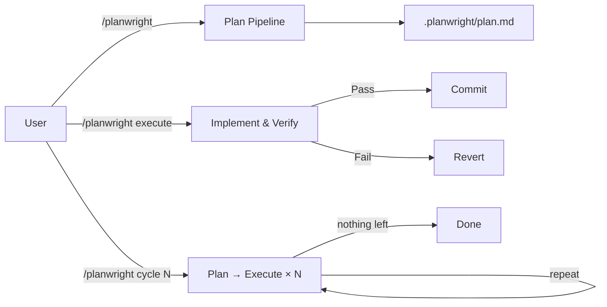

# planwright

**Grounded codebase planning for Claude Code.**

Planwright is a planning-first Claude Code skill that analyzes software projects, generates implementation plans, and optionally executes approved development tasks.

It operates using three distinct, partitioned paths:

- **Plan** — scans and audits the codebase, then runs a multi-stage pipeline to emit concrete, verified plan items into `.planwright/plan.md`. Read-only: the plan path writes only the plan file, never your source.
- **Execute** — implements the pending plan items, verifies each, commits the ones that pass, and records the rest. This is the only path that edits source.
- **Cycle** — runs N sequential plan→execute rounds unattended. Pass a positive number for a fixed count, or a negative number to run until the audit finds nothing left to do.



Claude runs every stage directly, so it costs no separate model calls and needs no external binary.

> **Note**: Planning never edits your application source. Only `/planwright execute` and `/planwright cycle` do — and even then, Claude Code's normal permission prompts for edits and commits still apply.

## Documentation

For deep dives into how `planwright` operates, refer to the documentation:

- [Usage](docs/usage.md): Detailed CLI reference, options, and execute modes.
- [Architecture](docs/architecture.md): Explanation of the 11-stage planning pipeline and execute loop.
- [Development](docs/development.md): How to develop this plugin and use the provided helper scripts.

## Install

```bash
/plugin marketplace add eserlxl/planwright
/plugin install planwright@planwright
```

Or add a local clone as a marketplace:

```bash
/plugin marketplace add <PLANWRIGHT_FOLDER>
/plugin install planwright@planwright
```

To use it without the plugin system, copy `skills/planwright/` into `~/.claude/skills/`.

## Quick Start

```bash
# Generate a plan for your project
/planwright

# Break a specific request into plan items
/planwright "add OAuth login"

# Execute the pending plan items automatically
/planwright execute

# Run plan→execute in a loop
/planwright cycle 3    # exactly 3 rounds
/planwright cycle -1   # unlimited rounds until the audit finds nothing left

# Maintenance
/planwright version    # show current and latest available version
/planwright upgrade    # update planwright itself to the latest version (alias: update)
```

## Development & Releasing

```bash
# Run the test suite
bash tests/run.sh

# Bump the version in manifests + CHANGELOG (does NOT tag or release)
scripts/bump-version.sh patch -m "what changed"

# Preview a bump without modifying files
scripts/bump-version.sh --dry-run patch

# Show usage for the helper scripts
scripts/bump-version.sh --help
scripts/make-plugin.sh --help

# Create a tagged release — only at milestones (every 25-50 commits or a
# meaningful feature: new subcommand, major behaviour change, etc.)
git tag vX.Y.Z <release-commit-sha>
git push origin vX.Y.Z
```

**Release policy:** `bump-version.sh` is for keeping version numbers current during development. Git tags and GitHub releases are reserved for milestones — not every small fix. Tagging too frequently fragments the changelog and dilutes the signal of what a "release" means.

## License

GPL-3.0-or-later. See [LICENSE](LICENSE).
